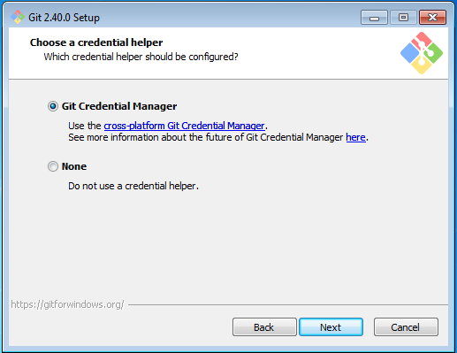
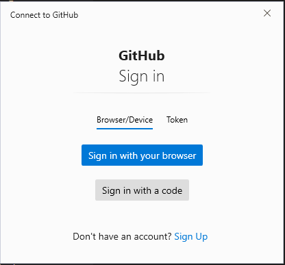
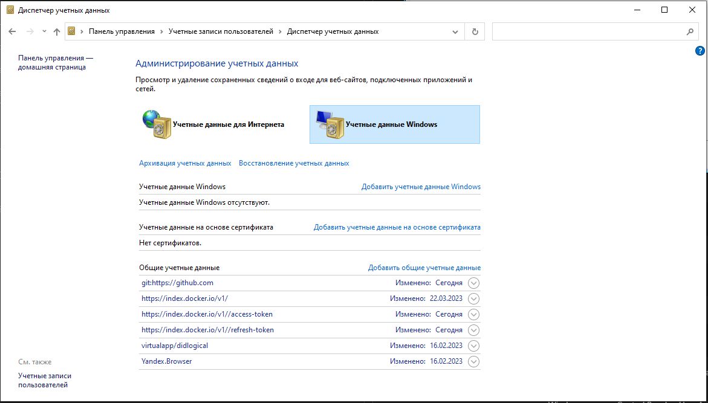

# Git Credential Manager

Устанавливается во время установки

Команда

    git config --list

иногда

    git config --global --list

показывает в списке этот менеджер.

    credential.helper=manager
  
После его установки вместо привычного спрашивания пользователя и токена один раз появляется диалоговое окно

 и сохраняет все данные в менеджер Windows по пути Control Panel → User Accounts → Credential Manager → Manage Windows Credentials (Панель управления\Учетные записи пользователей\Диспетчер учетных данных\Учетные данные Windows).

https://stackoverflow.com/questions/15381198/remove-credentials-from-git

[//]: 

После этого все "git push" выполняются без спроса пользователя и пароля.

Предлагают разные способы для удаления запоминания токена.  
https://stackoverflow.com/questions/15381198/remove-credentials-from-git  

Но лучше при установке Git сразу выбирать None.

