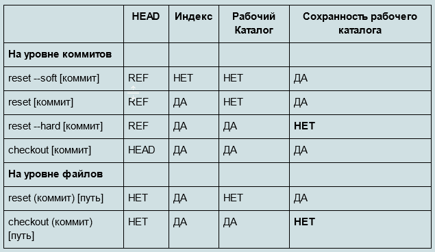

## Git, начало, кратко

### Создание локального репозитория

    git init
    git add .
    git commit -m "..."
    
    // не обязательно
    git tag -a 0.1

### Игнорирование ненужных файлов, .gitignore, пример:

    _example.md
    /.vagrant
    /storage
    /bootstrap/cache
    # this is a comment

### Добавление лицензии офлайн

Чтобы не добавлять лицензию онлайн, можно заранее добавить в локальный репозиторий готовый файл с лицензией (LICENSE, LICENSE.md или LICENSE.txt).

### После создания удаленного (онлайн) репозитория:

    git remote add origin https://github.com/...
    git push origin master

    // Не обязательно:
    // выкладка созданного тега
    git push origin 0.1   

### Добавление лицензии онлайн

Если не был изначально добавлен файл лицензии в локальный репозиторий.

- Создаётся пустой онлайн репозиторий без выбора лицензии
- Пушится локальный репозиторий в онлайн
- Создаётся онлайн файл лицензии. 
Либо путём "Add file->Create new file", либо через "Insight->Community Standarts".  
https://askdev.ru/q/kak-dobavit-licenziyu-v-suschestvuyuschiy-proekt-na-github-12837/  
Его названием может быть LICENSE, LICENSE.md, LICENSE.txt . CapsLock не обязателен, но используется, вероятно, для выделения среди других файлов проекта.  
Будет создан новый коммит. Его следует поместить напрямую (directly) в ветку master (единственная на даный момент).
- После этого выполнить - git pull origin master - для получения онлайн изменений в локальный репозиторий.

### Добавление запасной ветки develop

    git branch develop
    git checkout develop

### Дополнительные команды

    // список всех коммитов
    git log --oneline --all    

### Вызов справки по той или иной команде (ex., branch)

    git --help branch
    // откроется в браузере

---
В консоли GitBash:
-----

ГЛОБАЛЬНАЯ ПРОВЕРКА
----
список всех команд  
    
    git --help			    	    	            

список всех конфигураций  

    git config --list			    	            

список всех глобальных настроек  

    git config --global --list		        	    

назначение нового имени  

    git config --global user.name 'Name'

назначение новой почты  

    git config --global user.email 'Name@sbs.com'

Изменение глобальных настроек после коммита

    git config --global --edit
    git commit --amend --reset-author

--------------------

> Git Help

    git help command
выдаёт в браузер подробные опции команды.

    git help -a 	
выдаёт список доступных команд

также известны:

    git --help
    git help -g

----------------------------
----------------------------------------------------------------------------
ЛОКАЛЬНЫЕ ОПЕРАЦИИ
----------------------------
переход в диск С

    cd C:				    

переход в какую-то папку

    cd OSPanel/domains/		

"поселяем" git в эту папку

    git init

проверяет статус папки с git; наиболее часто используется, содержит тут же подсказки.

    git status			    

		
  Цветовые подсказки в названиях файлов проекта:
красный - либо не отслеживаются Гитом и не добавлены в staging area,
  либо отслеживаются и были изменены между коммитами.
зеленый - отслеживаются Гитом, т.к. добавлены в staging area, готовы к коммиту.
				
------------
Примечание:

Для игнорирования гитом файлов проекта в папке проекта создаётся из какой-либо программы текстовый файл .gitignore .
В нём прописываются относительные от этого файла пути к папкам и файлам (каждое в новой строке), к-рые нужно проигнорировать, напр., /css .
Комментарии в нем:  
    # this is a comment

------------

    git add .			
добавит все файлы (т.к. указана точка, но можно указывать и отдельные файлы через пробел) в подготавливаемую зону отслеживания (staging area)

    git add index.html light.png	
добавит файлы, перечисленные через пробел, в зону отслеживания (staging area)

    git commit -m'First commit'	
коммит (сохранение) с комментарием (судя по справке гита: (-м) - это message)

----------------
> Примечание: 

то, что создано в файловой системе, но не закоммичено - будет появляться во всех ветках проекта при переключении веток (при этом оно не отслеживается гитом и будет показываться в статусе как новое), и только после коммита Гит удаляет и добавляет эти файы в файловую систему в соответствии с ветками, к которым они принадлежат.

То, что заигнорено в .gitignore, будет переноситьсся и в другой набор файлов при переключении веток. Переносится оно как неотслеживаемое в staging area, как не add. (красное). При этом возможен уже новый .gitignore, который не игнорирует (не знает) эти файлы/папки.

----------------

это команда одновременно исполняет git add и git commit:  

    git commit -a  


пример команды git commit -a:  

    git commit -a -m 'h1 was added'  


Изменить сообщение коммита: 

    git commit --amend

посмотреть, добавлен ли наш коммит:  

    git log  

посмотреть введённые изменения:  

    git log -p  

посмотреть 2 последних коммита:  

    git log -2  

список всех логов:

    git log --oneline --all

-------

    git log  
фактически выводит лог текущей ветки, на к-рой находишься; другие ветки (и их коммиты), ответвлённые от старых  коммитов - не показываются.

-------

комбинация ctrl+c  
выйти из режима ожидания команд и перейти к возможности набора новой команды

q (при курсоре после двоеточия)  
видимо, правильный выход из режима ожидания

ESC :q  
выход из редактора VIM

иногда срабатывает ESC q q

    git reset HEAD index.html       
удаляет указываемый файл из staging area в предыдущее состояние

------

## Откат изменений

> Если изменения не закоммичены:

    git restore file    (изменения будут уничтожены)  
    
откатывает указанный “красный” (не add, не добавленный, модифицированный) файл к состоянию до модифицирования

    git restore .  

откатывает все “красные” файлы
    команда описывается в терминале при использовании git status,
    откатывает сохранённые в файлах изменения до предыдущего сохранения, зафиксированному в последнем коммите.

>   <b> git restore всегда безвозвратно стирает </b> сделанные изменения .


> Если изменения закоммичены:

Используется git reset  
https://git-scm.com/book/ru/v2/%D0%98%D0%BD%D1%81%D1%82%D1%80%D1%83%D0%BC%D0%B5%D0%BD%D1%82%D1%8B-Git-%D0%A0%D0%B0%D1%81%D0%BA%D1%80%D1%8B%D1%82%D0%B8%D0%B5-%D1%82%D0%B0%D0%B9%D0%BD-reset

или git checkout    
https://git-scm.com/book/ru/v2/%D0%9E%D1%81%D0%BD%D0%BE%D0%B2%D1%8B-Git-%D0%9E%D0%BF%D0%B5%D1%80%D0%B0%D1%86%D0%B8%D0%B8-%D0%BE%D1%82%D0%BC%D0%B5%D0%BD%D1%8B

Эти команды могут в некоторых случаях безвозвратно удалить данные из рабочего каталога.



[//]: Закомментировано:
[//]: 

Аменд перезаписывает последний коммит. Для незначительных изменений в последнем коммите. Нельзя использовать --amend, если коммит уже запушен.

    git commit --amend      
        Можно использовать для изменения сообщения в коммите.

В случае с незначительным изменением в файлах, сначала добавляются файлы в отслеживаемый Индекс (add), потом --amend:
```
git add forgotten_file
git commit --amend
```
Нельзя использовать --amend, если коммит уже запушен. Это запретит пушить новые коммиты. Потребуется устроить pull из онлайна в локальную директорию, также будет автоматически смерджен пустой коммит. В итоге это приведёт к двум дополнительным коммитам, один из которых будет пустой.

Изменение коммитов в git:
https://habr.com/ru/post/201922/


----

## Возврат к предыдущему коммиту

[ru.Stackoverflow](https://ru.stackoverflow.com/questions/431520/Как-вернуться-откатиться-к-более-раннему-коммиту)

Как вернуться (откатиться) к более раннему коммиту?

> Временно переключиться на другой коммит:

    git checkout  fed7ce7

Чтобы переключиться обратно:

    git checkout develop

Если делались какие-то (ненужные) изменения, то переключиться можно так:

    git restore .
    git checkout develop


Посмотреть все коммиты, независимо от переключения:

    git log --all
 
Краткий список коммитов:
```
git log --all --oneline
git log --oneline
git log -2 --oneline
git log --oneline -2
```

----

## Switch

Согласно описанию https://git-scm.com/docs/git-switch  :

    git switch -c new-branch-name

Переключиться на указанную ветку. Рабочее дерево и индекс обновляются в соответствии с веткой. Все новые коммиты будут добавляться в верхушку этой ветки. 

---
## Внесение изменений с созданием ветки
Переключиться в старый коммит:

    git checkout  fed7ce7

Создать и сохранить изменения в файлах

Создать новую ветку (vid_6):

    git branch vid_6

Переключиться в новую ветку: 

    git checkout vid_6

Закоммитить изменения:

    git add  
    git commit -m "..."

Вернуться назад:

    git checkout develop

Выложить новую ветку:  

    git push origin develop vid_6

## Внесение изменение в старые коммиты

Можно указать коммит, после которого (не в нём) нужно вносить изменения.

    git rebase -i 0b5e174

Появится текстовый редактор со списком коммитов после указанного.  
Если на этом этапе удалить все незакомментированные строки, команда rebase будет прервана.  
Если на этом этапе удалить отдельную незакомментированную строку с описанием коммита, коммит будет удалён!

Вероятно, далее:  
согласно https://habr.com/ru/post/201922/,  

- вместо pick у нужного коммита должна быть указана буква е для редактирования и сохранен текстовый редактор.
- появится подсказка в Git Bash о порядке фиксирования изменений
- после внеснения изменений в файлы   
    git add .
- затем  
    git commit --amend
- затем, согласно подсказке в Git Bash  
    git rebase --continue

## Посмотреть (открыть) все ветки клонированного репозитория

https://ru.stackoverflow.com/questions/525610/клонирование-веток-удаленного-репозитория  
https://progi.pro/ya-ne-vizhu-vetki-pri-klonirovanii-repozitoriya-8098228  
https://githowto.com/ru/remote_branches  
https://githowto.com/ru/adding_a_tracking_branch  

Переключиться на нужную ветку:

    git branch -r
    git checkout no-master

---


---
РАБОТА ОНЛАЙН
------

Не обязательно, но по рекомендации 
сначала создаётся локально рабочий репозиторий (git init),
 потом создаётся пустой новый репозиторий на сайте.

```
git remote add origin https://github.com/dm-sytnik/git_test.git
или
git remote add origin https://sytnic@bitbucket.org/sytnic/widget-corp.git
```

-    в Git BASH в папке с проектом команда связывает удаленный и локальный проекты (origin  краткое название удаленной папки). 
-    обычно выполняется единожды. 
-    remote add переводится как "удалённое добавление".
-----
Именно так связывается локальный проект (неважно, в какой он папке) с указанным в строке проектом на github.

-------------

## Работа с origin

    git remote show origin

посмотреть, что понимается под origin, какая удалённая папка и какие там есть ветки.

    git remote remove origin

удаляет связку удаленного и локального репозитория, открепить удалённый репозиторий

https://git-scm.com/book/ru/v2/Основы-Git-Работа-с-удалёнными-репозиториями

---

## Работа с токенами

C токенами, можно так:  

    git remote add origin https://<access-token-name>:<access-token>@gitlab.com/myuser/myrepo.git

 https://stackoverflow.com/questions/42074414/gitlab-push-to-a-repository-using-access-token


Проще всего по-старому, вместо пароля вводится токен:  

    git remote add origin https://github.com/myuser/myrepo.git

------------

    git push	

-    обычная команда без ключей. 
-    она пушит (публикует в онлайн гит-репозиторий) текущую ветку, на которой мы сейчас находимся, с текущими зафиксированными коммитами. 

    git push origin develop		

-    пушит ветку develop в публичный репозиторий, обозначенный именем origin. 
-    Наиболее правильный способ. 
-    Используется в Gitflow.
----------

>    ответ на вопрос: как появляются релизы/версии в онлайн в гите?

- они появляются когда ты пушишь данную ветку в онлайн. название ветки будет отображаться в гит-онлайн.
    аналогично ветка master или develop постоянно коммититься локально и пушится в онлайн, релизы же(версии) обычно не обновляются долго, а удаляются локально, они являются временными ветками, поэтому они один раз выкладываются, сохраняются со своим названием в онлайне и так и сохраняются, локально удаляются. новые версии - это будут новые временные ветки.

----------

    git push -u origin master

-    команда посылает локальную папку с зафиксированными изменениями ветки master в удаленный репозиторий; в дальнейшем ключ -u позволяет не повторять "-u origin master" (будет просто git push). 
    Но наверное лучше не использовать, чтобы случайно не запушить не то, что хочется, т.к. есть обычная команда без ключей.

---------------
Повседневная работа разработчика:

Файлы в локальной папке нужно
- проиндексировать (git add)
- закоммитить (git commit) и
- запушить (git push)
---------------

### Отправить удаленные изменения в локальный репозиторий

    git pull			

команда, обратная команде git push. она отправляет удаленные изменения в локальный репозиторий

    git pull origin branch


    git clone https://github.com/dm-sytnik/git_test.git

команда клонирует онлайн-проект в подпапку, которую создаёт автоматически

    git clone https://github.com/dm-sytnik/git_test.git .
    # точка будет означать, положить все файлы и папки в текущую папку, а не подпапку
    # без точки - положить здесь же всё в одну подпапку, названную как репозиторий в гит-онлайн 

    git checkout --track -b local_branch_name origin/remote_branch_name

начинает локально отслеживание онлайн-ветки, 
     по умолчанию после clone открыто показывается только master

---------------------------------
---------------------------------------------------------------------------
ВЕТВЛЕНИЯ И СЛИЯНИЯ:
--------------------
Работа с ветками в Git BASH:

список веток:

    git branch  

создание новой ветки с названием branch2:  

    git branch branch2  

переход в ветку branch2:  

    git checkout branch2  

создание ветки branch3 и переключение в эту ветку:  

    git checkout -b branch3  


слияние ветки branch2 c master, если из ветки master набрать: 

    git merge branch2  

переименование:  
    
    git branch (-m | -M) [oldbranch] newbranch  
 
With a -m or -M option, oldbranch will be renamed to newbranch


-----------
Конфликт слияния веток:

    Если будет конфликт слияния, будет подсказка в Git BASH и текущая ветка обозначится например как (master|MERGING).
    Следующий за этим коммит будет признан как решающий проблемы конфликта и принят как есть, причём только в данной ветке (master)!

    При отсутствии конфликта команда git merge автоматически создаст слияние.
-----------
---------------------
    Merge работает как коммит, т.е. фиксирует изменения как коммит.
Merge удаляет файлы текущей ветки и добавляет файлы сливаемой ветки.

---------------------
"Merge" показал восхитительное понимание. При слиянии проекта webcode и перелопаченного по отношению к нему и в сущности иного bike-sytnic - произошло идеальное слияние без конфликтов: webcode был удалён, bike-sytnic добавлен и сразу заработал при проверке OSpanel'и. И это при том, что многие файлы даже гитом были признаны как одни и те же, несмотря на расположение в разных папках. 

Т.е. часть папок и файлов были абсолютно новыми, а другие - старыми. Проверка размеров и количества файлов показала, что перенесён был весь и только проект bike-sytnic, webcode был удалён полностью.

---------------------
---------------------

удаление ветки branch2, если из ветки master набрать  

    git branch -d branch2		


если ветка еще не существует на ремоут сервере, то запушить ее можно командой  

    git push --set-upstream origin my-branch

-------------------------------
-----------------------------
------------
> справка по тегам

------------
    git tag word  
сразу создаст тег под этим словом/числом word без аннотации

    git tag -a word  
создаст тег под этим словом/числом word с аннотацией

или такой вариант с аннотацией, тогда редактор не открывается поверх:  
    git tag -a 4.0 -m "Version 4.0"			

    git tag --list		    список тегов
    git tag			        список тегов
    git show-ref --tags		список тегов с коммитами

    git tag -v tagname  
посмотреть про конкретный тег

    git show tagname  
подробно содержимое всех файлов согласно тегу

    git help tag

    git tag -d tagname  
удаляет тег

    git checkout tags/1.0  
переключаемся на тег 1.0, да, именно со слэшем.

> как запушить тег в онлайн:

    git push origin tagname  
пушит этот тег в онлайн

    git push origin --tags  
пушит все сохраненные теги в онлайн

------------

-----------------------------
ОБЩИЕ КОМАНДЫ uNIX:
-------------------

стрелка вверх, стрелка вниз  
предыдущая, следующая уже вводимая команда

    pwd  
текущая папка (print working directory)

    ls  
список находящегося в текущей папке

    ls -la  
подробный список находящегося в папке (с правами доступа)

    ls -a  
список всего находящегося в папке, включая скрытое (-a == all)

    ls chapter  
вывести содержимое подпапки

    cd  
change directory («изменить директорию»)

    cd ..  
переход на папку вверх

    mkdir  
make directory («создать директорию»)

    shift+insert  
вставка из буфера обмена

-----------------------------

Папки в Windows с поселённым туда гитом можно полностью перемещать, т.е. вырезать и вставлять в другое место целиком как папку (чтобы захватить внутри неё скрытую папку .git). Это не повредит знанию Гита про эту папку.

