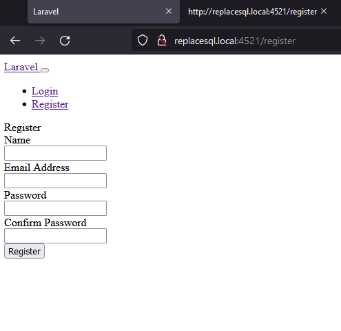

# Установка Laravel

## Установка Linux in VirtualBox

> Создать новую папку

> Под Vagrant потребуется 2 файла (можно из старого проекта):
- Vagrantfile и 
- bootstrap.sh 

> Указать в Vagrantfile 
- название будущего сайта (project_slug = "site"), 
- корень сайта (document_root = "public") и 
- порт (config.vm.network:..., host: 4511)

На базе bootstrap.sh  
автоматически будет настроено для Apache в /etc/apache2/sites-enabled/default.conf 
- имя сайта (оно может иметь дополнительный суффикс (.local)),
- корневая папка сайта.

> В Windows имя сайта также нужно прописать в hosts (с суффиксом) .

> Запуск в терминале для этой папки:  
    
    vagrant up  

Если потребуется старая версия composer:  
https://stackoverflow.com/questions/64597051/how-to-downgrade-or-install-a-specific-version-of-composer

> Проверка сайта в браузере 

Проверять подготовленными файлами.  
Подгружается из корневой папки.  
Но если использовалась переменная document_root="public", особенно в секции VHOST= для Апача, то подгружаться будет из папки public/.

> Проверка установок в терминале

Войти: 
    
    vagrant ssh  

Проверить:

    composer -V  
    php -v
    git --version
    node -v
    

Про nodejs и npm:

    nodejs -v
    npm -v

Удалить nodejs:

    sudo apt-get purge nodejs

Если npm не установился, то команда:

    sudo apt install npm

Проверить MySQL:

    mysql --version

    mysql -u project_slug -p
      or
    mysql -u project_slug --password="project_slug"

    SHOW DATABASES;
    USE project_slug;
    SHOW TABLES;

    exit

---
## Установка Laravel

    vagrant ssh

 Перейти в нужную папку. /var/www/...
 или
 /vagrant/

    composer create-project laravel/laravel

другие варианты:

    composer create-project --prefer-dist laravel/laravel
    composer create-project --prefer-dist laravel/laravel blog

--prefer-dist - это команда композера, она пытается загрузить и распаковать архивы зависимостей с помощью GitHub или другого API, когда это возможно. В большинстве случаев это используется для более быстрой загрузки зависимостей.

    composer create-project --prefer-dist laravel/laravel blog "5.8.*"
    composer create-project --prefer-dist laravel/laravel blog "8.*"

Этой командой из текущей папки устанавливается версия 5.8 (8.*) в пустую подпапку (blog), она создастся автоматически. Указание подпапки blog в этой команде (в случае указания версии laravel) - обязательно.    

После чего нужно вырезать и вставить все файлы в верхнюю папку из подпапки.  
По идее всегда устанавливается в подпапку; если не указать подпапку, установится в подпапку "laravel".

> Проверка в браузере

По локальному имени сайта и по порту. Подгружаться будет из папки public.

> Проверка в терминале

    php artisan -V

---

## Git

Отключение папок в .gitignore

    /.vagrant
    /storage
    /bootstrap/cache
    /node_modules

Новый локальный репозиторий

    git init

Коммит

    git add .

    git commit -m "..."

> В дальнейшем:  
> Создать ветки и связать репозиторий с удалённым

> Создать желаемые ветки

    git branch develop

    git checkout develop

> Создать удаленный репозиторий  
> Добавить связку удаленного и локального репозиториев

    git remote add origin https://github.com/myuser/myrepo.git

    git push origin master

---
## Установка и проверка авторизации

> Создание авторизации:  

Для версий Laravel 5.8 и раньше:  

    php artisan make:auth

Визуально в шапке появятся две ссылки, по которым можно регистрироваться и входить:
- http://mysite.local:4518/login
- http://mysite.local:4518/register

В коде появится:
- файл app\Http\Controllers\HomeController.php
- группа файлов в \resources\views\auth
- файл resources\views\home.blade.php

Скорректируется routes\web.php

--

Для версий Laravel старше 5.8: 
https://stackoverflow.com/questions/66188968/how-to-properly-start-laravel-8-with-bootstrap-authentication

    composer require laravel/ui
      or 
    composer require laravel/ui --dev 

    php artisan ui bootstrap
    php artisan ui bootstrap --auth
    npm install && npm run dev

Внимание! Вторая команда "php artisan ui bootstrap" может не отработать по факту (файл со стилями bootstrap"public/css/app.css" не появится), из-за чего всё будет выглядеть без стилей:

Решил так:  
скопировал в этот проект из другого папку "public/css/app.css" .  
js-ы у меня не заработали.  

---
> Позже, при создании таблиц для БД:

При этом для создания таблиц БД под авторизацию должна быть запущена команда

php artisan migrate

Будут созданы пустые таблицы для авторизации из файлов миграций, находящихся в database/migration/.  

---
## Создание нового соединения в Workbench

> Настройка .env файла  

Значения заданы на основе $PROJECT_SLUG в bootstrap.sh

    DB_DATABASE=posty
    DB_USERNAME=posty
    DB_PASSWORD=posty

> Новое соединение: MySQL Connections (+)

Заполнить:
- connection name: любое
- connection method: Standart TCP/IP over SSH
- SSH hostname: 127.0.0.1:2222 (Вагрант подключается через :2222)
- SSH username: vagrant (это особенность Вагранта, при подключении командой - vagrant ssh)
- SSH keyfile: отсутствует
- MySQL hostname: 127.0.0.1
- MySQL server port: 3306
- username: posty (создавался в Vagrantfile (и bootstrap.sh в секции про MySQL) как $PROJECT_SLUG)

Вход через SSH в MySQL: 
- vagrant vagrant (особенности Вагранта по SSH)
- posty posty (соответствует названию сайта; особенности настройки $PROJECT_SLUG в bootstrap.sh в строке # Create a database user)

> Создание базы данных

Она уже создана из bootstrap.sh. Использовалась строка типа
    
    CREATE SCHEMA `poligon` DEFAULT CHARACTER SET utf8mb4 COLLATE utf8mb4_unicode_ci;
    
Кодировка utf8mb4 описана здесь:

    Index Lengths & MySQL / MariaDB
        https://laravel.com/docs/5.7/migrations#indexes :
    Laravel uses the utf8mb4 character set by default

> Подстройка Laravel под MySQL
 
 Для MySQL/MariaDB нужно будет добавить следующие строки в  
 app\Providers\AppServiceProvider.php,  
    описание здесь:  
    Index Lengths & MySQL / MariaDB  
    https://laravel.com/docs/5.7/migrations#indexes  
    https://laravel.com/docs/8.x/migrations#index-lengths-mysql-mariadb :

    
    ...
    use Illuminate\Support\Facades\Schema;
    ...    
    public function boot()
    {
        Schema::defaultStringLength(191);
    }
---
## Создание таблиц БД под авторизацию

Миграции - это описание столбцов таблиц (для создания пустых таблиц).  
Сидеры и Фабрики - чем заполнять таблицы.  
database\seeds\DatabaseSeeder@run - в какой последовательности заполнять БД.  

> Первая Миграция  
> Создание таблиц для авторизации

Файлы миграции для авторизации уже созданы автоматически и расположены в database/migration/.  
Вход:

    vagrant ssh
    cd /var/www/project

Далее команда:  

    php artisan migrate

Будут созданы пустые таблицы для авторизации из файлов миграций.  
Суть команды - она запускает все миграции ("Run the database migrations").

---
## Настройка Laravel

> Установка дебаг-бара

Будет прописан в /vendor, composer.json

    composer require barryvdh/laravel-debugbar --dev

При ошибке установки на Laravel 5.8 встала версия 3.0:

    composer require barryvdh/laravel-debugbar:~3.0 --dev

Debugbar включается/отключается в файле .env

    APP_DEBUG=true
        или
    APP_DEBUG=false

---
## Создание таблиц БД

Пример.  
Создание файла миграции "create_sqltext_table" под будущую таблицу "sqltext"

    php artisan make:migration create_sqltext_table --create=sqltext

Далее, заполненние этого файла вручную. И запуск миграции (отработают только новые файлы миграции).

    php artisan migrate

Будут созданы пустые таблицы.

Команда:

    php artisan migrate:refresh

сотрёт и создаст пустые таблицы заново. 

Чтобы не были задеты ненужные таблицы, можно перед выполнением migrate  
либо переместить ненужные миграции из папки куда-либо,  
либо переместить нужную миграцию в новую внутренню папку и запустить migrate c указанием --path...  
либо удалить нужную таблицу или нужную строку миграции из БД.  
https://coderoad.ru/19102197/%D0%97%D0%B0%D0%BF%D1%83%D1%81%D0%BA-%D0%BE%D0%B4%D0%BD%D0%BE%D0%B9-%D0%BA%D0%BE%D0%BD%D0%BA%D1%80%D0%B5%D1%82%D0%BD%D0%BE%D0%B9-%D0%BC%D0%B8%D0%B3%D1%80%D0%B0%D1%86%D0%B8%D0%B8-Laravel-%D0%BE%D0%B4%D0%B8%D0%BD-%D1%84%D0%B0%D0%B9%D0%BB

Также есть способ использовать откат нескольких последних миграций

    php artisan migrate:refresh --step=2

Статус с миграциями (таблица с ними аналогична): 

    php artisan migrate:status

---

