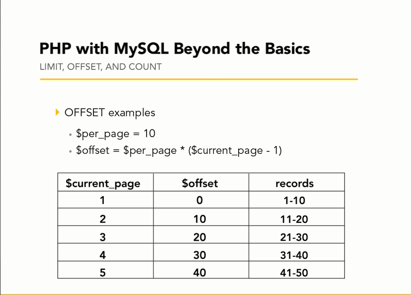
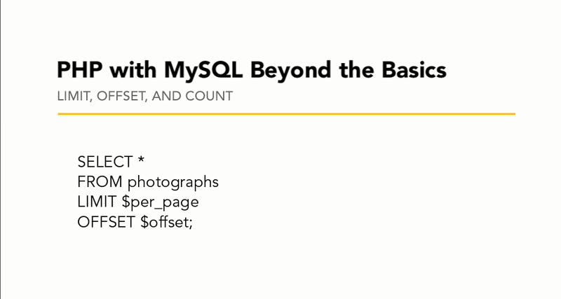
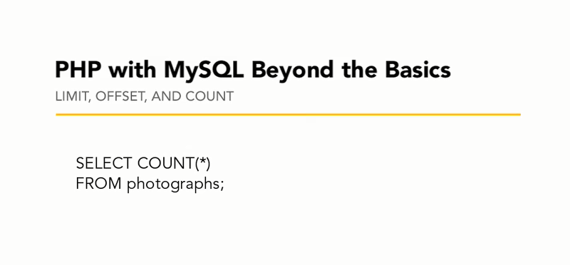

## Пагинация

Как расчитывается смещение.  
Сколько записей из БД надо пропустить, вызывая соответствующую страницу.

Конкретная выборка на страницу. Запрос SELECT.

Определение всего количества записей

